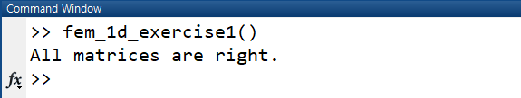

# Basic Finite Element Method (FEM) Tutorial

This repository contains FEM tutorial for beginners. It consists of a bunch of MATLAB codes to solve Poisson's problem. If you are not familiar with MATLAB, you can refer to [MATLAB tutorial](https://www.tutorialspoint.com/matlab). In each folder, {folder_name}.pdf leads you through implementing FEM codes for various finite element spaces. There are also several exercises to make sure you understand.

## Table Of Contents

* [Finite Element Method in 1D](https://github.com/dw-shin/basic_fem_tutorial/tree/master/fem_1d)
* [Finite Element Method in 2D with rectangular elements](https://github.com/dw-shin/basic_fem_tutorial/tree/master/fem_2d_rectangle)
* [Finite Element Method in 2D with triangular elements](https://github.com/dw-shin/basic_fem_tutorial/tree/master/fem_2d_triangle)

## How to check your code
When you are done with an exercise, run the code in command window.

